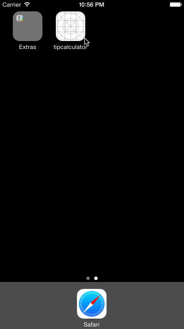

# TipCalculator

This is a Tip Calculator application for CodePath iOS Bootcamp class.

Time spent: 8 hours

Completed:

* [x] Required: User can input bill amount and choose tip percentage.
* [x] Required: Calculate the tip amount and total value.
* [x] Required: Settings page to choose default tip percentage.
* [x] Optional: Dynamically caclulate the tip and total amount while user editing the bill amount.
* [x] Optional: Allow user to choose number of people to split the bill.
* [x] Optional: Set bill input field as the first responder.
* [x] Optional: Allow user to save and view last bill information (including bill amount, date and location)

Notes:

This only works for iPhone 6 and iPhone 6 plus.

GIF created with [LiceCap](http://www.cockos.com/licecap/).